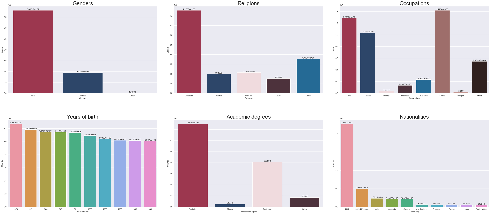

# Data Story

### Made by the R.O.C.K Team for the project in the course CS-401 Applied Data Analysis at EPFL

#### Team members: Raphaël, Oskar, Celinna, Karim

In this project we are analysing the large dataset [Quotebank](https://dlab.epfl.ch/people/west/pub/Vaucher-Spitz-Catasta-West_WSDM-21.pdf)

Click [here](https://ohallstrom.github.io/data-story/) to reach our website.

To cope with limited computing resources, we use a sample of the data in the data story. However, we actually did create features for the millions of quotes available, as well as having a look at the speaker attributes for all of the quotes. Below you can see an early plot from our project (without the final graphic profile), showing the distribution of speaker attributes for all of the 47 779 271 quotes we treated.

Website was created using [Beautiful Jykell](https://github.com/daattali/beautiful-jekyll).

(Ongoing project)
