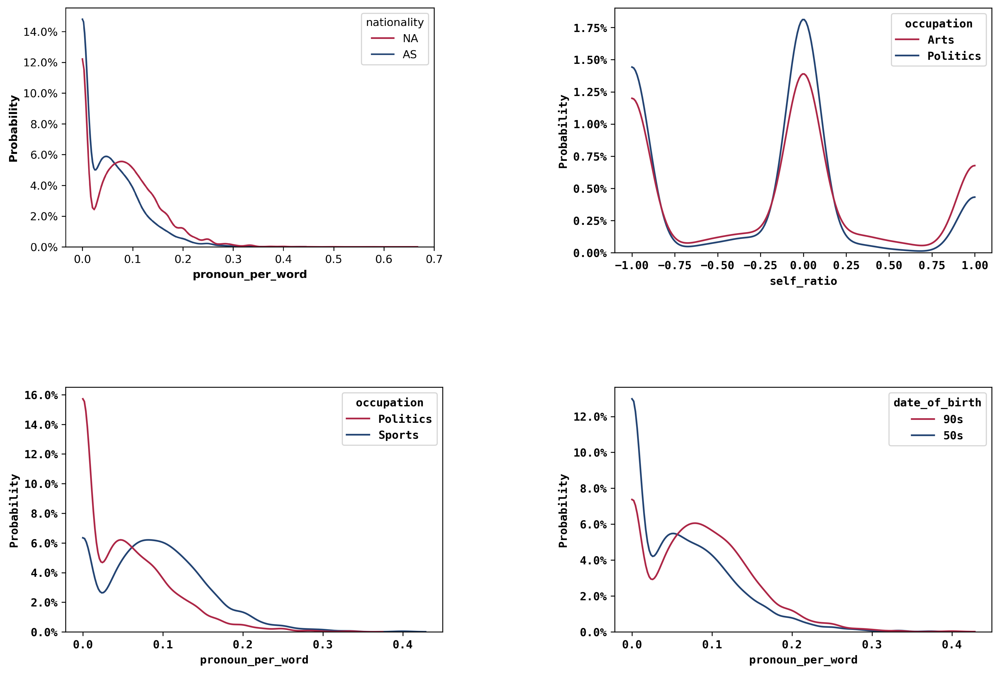

## An unfortunate data story
We started this project with the goal of finding patterns between language use and speaker attributes based on the analysis of millions of quotes in the [Quotebank](https://dlab.epfl.ch/people/west/pub/Vaucher-Spitz-Catasta-West_WSDM-21.pdf) dataset. Our goal was to answer questions such as:
* How does your socio-cultural background, such as nationality, gender, or religion, affect the way you speak?
* Are people who speak about the past usually older?
* Are people who speak with a more positive sentiment usually young?
However, we could not find sufficient patterns between speakers and the way they talk to accurately describe the speaker’s attributes based on a given quote. Nevertheless, we are happy with our findings. To live in a less predictable world, in which we cannot tell exactly who a person is simply by looking at the language features of their quotes, is certainly much more fun. Please follow us on this journey, in which we find out what we can (or maybe more appropriately cannot) say about someone based on their language usage.

## What data is our story based on?
We were given a gigantic amount of data: quotes extracted from newspapers from 2015 to 2020, tens of millions of rows to work with. But that is great, the bigger the data, the more trust-worthy the study. After some intense pre-processing and filtering -- you can read more about it in [this](https://github.com/epfl-ada/ada-2021-project-r-o-c-k/blob/main/Milestone%202/preprocessing_notebook.ipynb) Notebook. We eventually ended up working with exactly 47 779 271 quotes, shared between 451 041 different unique speakers. For the sake of the study, filtering has been performed in order to keep speakers that were born between 1928 and 2016, as it would not make much sense to study the speech of an ancient Roman emperor or a young baby barely able to talk in our contemporary context. For this analysis, six different speaker features were kept: year of birth, gender, occupation, academic degree, and nationality. 

We created features for the millions of quotes available, as well as looked at the speaker attributes for all of the quotes. To cope with limited computing resources, we use a sample of the data to form this data story. However, an early plot from our project, showing the distribution of speaker attributes for all of the 47 779 271 quotes we treated, can be found on this [link](https://github.com/ohallstrom/data-story/blob/master/assets/img/AllQuotesDistribFinal.png).

Anyways, images speak louder than words so below are the distributions of the speaker attributes for all of the quotes in our sample: 

# ADD RAPH's PLOT

Even though we cannot be certain, it seems like the speakers are dominated by North Americans, Christians and Males...

To show the lexical features that this Data Story is based on, we have used a quote by the R.O.C.K team’s spiritual leader Dwayne Johnson, also known as The Rock. For each quote in Quotebank, the features seen in the following image were generated. 

Please refer to our [README](https://github.com/epfl-ada/ada-2021-project-r-o-c-k/blob/main/README.md) for a more in depth description of the features.

## What does our data look like?
Here is a sneak peak on how the lexical features are mapped to speaker attributes. The boxplots shown are just a fraction of all combinations of lexical features and speaker attributes. We only show one boxplot per lexical feature here, but you can explore as much as you want to satisfy your “data hunger” with [this](https://github.com/epfl-ada/ada-2021-project-r-o-c-k/blob/main/feature_exploration.ipynb) Notebook.

## Heat maps and distributions

In order to identify the major differences between the language usage of different types of speakers, the statistical Mann-Whitney-U-test is applied on the dataset. With this test, the distribution of a particular lexical feature for different speaker attributes are compared. The U-test outputs a p-value which represents the probability of observing these differences in the samples given that they both come from the same underlying distribution. Given the large number of possible U-tests per cell, two different scoring metrics are used:

$Score_{med} = \frac{1}{\med_{P_{i}}}$

$Score_{max} = \frac{1}{\max_{P_{i}}}$

  
  

## Gender Bias?

## Model Fitting, Clustering and PCA

## Discussion

People that are quoted are often public figures.
Quotes are usually not said in an informal context.

## Conclusion
