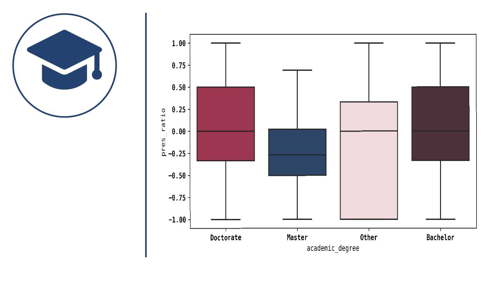
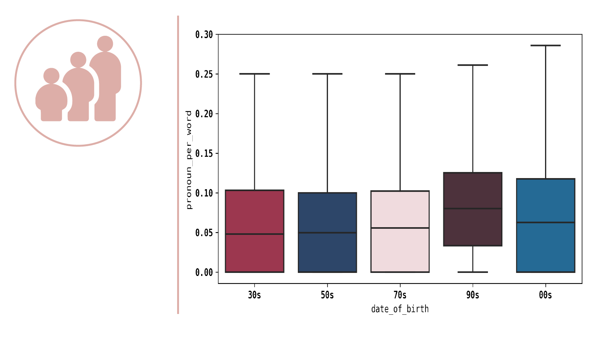
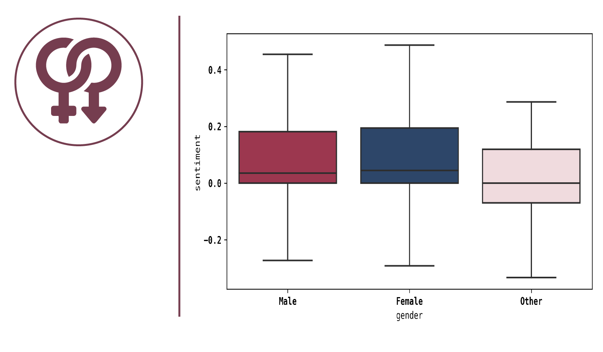
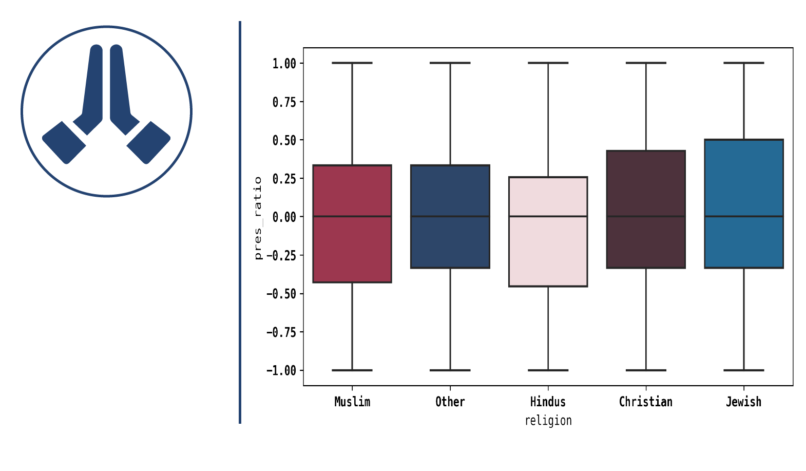

## An unfortunate data story
We started this project, in which we analyse millions of quotes, with the goal of finding patterns between language use and speaker attributes. Maybe we could have gotten answers to questions such as:

* Are people who speak about the past usually older?
* Are people who speak with a more positive sentiment usually young?

However, we could not find any patterns between speakers and the way they talk. Nevertheless, we are happy with our findings. To live in a less predictable world,
in which we can not tell exactly who you are simply by looking at the used language features, is sure much more fun.

Please follow us on this journey, in which we find out what we can (or maybe more appropriately can't) say about someone base on their language usage.

{:height="40%" width="40%"} {:height="40%" width="40%"}
{:height="40%" width="40%"} {:height="40%" width="40%"}
{:height="40%" width="40%"} {:height="40%" width="40%"}

## What data is our story based on?

## What does our data look like?
Box plots 

## Heat maps 

## 

## Discussion
People that are quoted are often public figures.
Quotes are usually not said in an informal context.

## Conclusion
