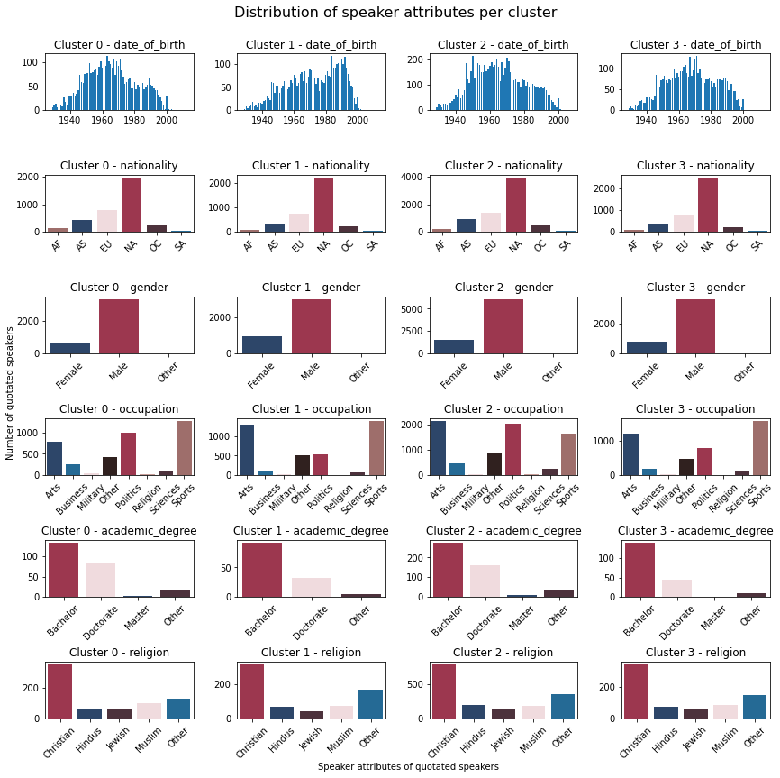

## An unfortunate data story

We started this project with the goal of finding patterns between language use and speaker attributes based on the analysis of millions of quotes in the [Quotebank](https://dlab.epfl.ch/people/west/pub/Vaucher-Spitz-Catasta-West_WSDM-21.pdf) dataset. Our goal was to answer questions such as:

* How does your socio-cultural background, such as nationality, gender, or religion, affect the way you speak?
* Are people who speak about the past usually older?
* Are people who speak with a more positive sentiment usually young?

However, we could not find sufficient patterns between speakers and the way they talk to accurately describe a speaker based solely on their quotes. Nevertheless, we are happy with our findings. To live in a less predictable world, in which we cannot tell exactly who a person is simply by looking at the language features of their quotes, is certainly much more fun. Please follow us on this journey, in which we find out what we can (or maybe more appropriately cannot) say about someone based on their language usage.

## What data is our story based on?

We were given a gigantic amount of data: quotes extracted from newspapers from 2015 to 2020, tens of millions of rows to work with. But that is great, the bigger the data, the more trust-worthy the study. After some intense pre-processing and filtering (you can read more about it [here](https://github.com/epfl-ada/ada-2021-project-r-o-c-k/blob/main/Milestone%202/preprocessing_notebook.ipynb)), we eventually ended up working with exactly 47 779 271 quotes, shared between 451 041 different unique speakers. For the sake of the study, filtering has been performed in order to keep speakers that were born between 1928 and 2016, as it would not make much sense to study the speech of an ancient Roman emperor or a young baby barely able to talk in our contemporary context. Six different speaker attributes were kept: year of birth, gender, occupation, academic degree, and nationality. 

We created lexical features for the millions of quotes available and combined it with the speaker attributes for all of the quotes. To cope with limited computing resources, we use a sample of the data to form this data story. You can find an early plot from our project, showing the distribution of speaker attributes for all of the 47 779 271 quotes we treated [here](https://github.com/ohallstrom/data-story/blob/master/assets/img/AllQuotesDistribFinal.png).

Since images speak louder than words, below are the distributions of the speaker attributes for all of the quotes in our sample: 

## TODO: ADD RAPH's PLOT

Even though we cannot be certain, it seems like the speakers are dominated by North Americans, Christians, and Males...

To show the lexical features that this story is based on, we have used a quote by the R.O.C.K team’s spiritual leader Dwayne Johnson, also known as The Rock. For each quote in Quotebank, the features seen in the following image were generated. 

# TODO: Correct typos in image
# TODO: Accept Oskar's proposition

If you did the math, you might have expected a higher verb count for the given quote. However, we do not include modal auxiliaries when counting the verbs, so 'can' is not counted as a verb. Also, you might have expected the superlative ratio to be the highest adjective ratio. But the ratios for adjectives are, due to our pos-tagging on single words, only identifying single word comparative adjectives and superlatives. Whenever an adjective is constructed with a 'more' or 'most' in front of it, it is still counted as an ordinal adjective. That is why we do not include these ratios in our further analysis. Please refer to our [README](https://github.com/epfl-ada/ada-2021-project-r-o-c-k/blob/main/README.md) for a more in depth description of the lexical features.

## What does our data look like?

Here is a sneak peak on how the lexical features are mapped to speaker attributes. The boxplots shown are just a fraction of all combinations of lexical features and speaker attributes. We only show one boxplot per lexical feature here, but you can explore as much as you want to satisfy your “data hunger” [here](https://github.com/epfl-ada/ada-2021-project-r-o-c-k/blob/main/feature_exploration.ipynb).

# TODO: increase readability of labels?

## Heat maps and distributions

In order to identify the major differences between the language usage of different types of speakers, the statistical Mann-Whitney-U-test is applied on the dataset. With this test, the distribution of a particular lexical feature for different speaker attributes are compared. The U-test outputs a p-value which represents the probability of observing these differences in the samples given that they both come from the same underlying distribution. Given the large number of possible U-tests per cell, two different scoring metrics are used:

## TODO: Formula formatting problem

$Score_{med} = \frac{1}{\med_{P_{i}}}$

$Score_{max} = \frac{1}{\max_{P_{i}}}$

As seen from the figures above, it seems that some cells embed significant differences in their distribution. These cells exhibit a high score value either in terms of median or in terms of maximum observed p-value. Large differences are observed from both the median and maximum grid. For instance in [Occupation, Pronoun_per_word], [Gender, Self_Ratio], [Gender, Union_Ratio] … We might be discovering something huge in terms of socio-cultural and language research -- An ADAventurer’s dream coming true. But wait a second, why is the median score so low? Does it mean that only specific pairs within a speaker attribute are different?

We looked more closely at the most significant and least significant differences by plotting their distributions. Here are the top 4 pairs of distributions with the most significant difference, as well as the top 2 pairs of distributions with the least significant difference. Specific feature/attribute distributions can be found [here](https://github.com/epfl-ada/ada-2021-project-r-o-c-k/blob/main/feature_exploration.ipynb).
## TODO: Don't we need to add the plots such as self_ratio for artists and politicians in the notebook above

### Distributions with most significant differences
Significant differences can be seen between various lexical features and date of birth and occupation, shown below. The following can be said: First, speakers born in the 90s seem to use more pronouns than those from the 50s. Second, differences are observed between Politicians and other occupations such as Arts and Sports. Politicians speak more about “us” as a group than artists. And for the ones who only mention themselves in the quotes, it is more likely that they are an artist than a politician -- Well, that is obvious and quite intuitive! Can we get to the juicy part?

  
  

These two quotes found on Quotebank have been selected as they perfectly support the previous findings: Margot Robbie, a famous actress, uses 4 self pronouns ('I', 'my', 'my', 'I') out of 4 pronouns; whereas Chuck Schumer, a politician, uses 4 union pronouns ('We' 4 times) and  1 other pronoun ('You'). Margot Robbie's quote's union_ratio and self_ratio are respectively -1 and 1, while Chuck Schumer's quote's union_ratio self_ratio are respectively 0.8 and -1.

Among the distributions with statistically significant differences, we can also see interesting relationships in pairings with lower rankings. Looking at the nationality, one can notice a difference in the distributions of pronouns and the number of words used between North America and Asia. 

We know you probably went all the way to the bottom of this hoping to find something about gender biases -- quite a hot topic. But you will probably not find what you are looking for.  

Men and women displayed similar speech patterns. The distribution in terms of sentiment, pronouns, and reference to the “self” show a lot of overlap. Other lexical features / speaker attribute combinations show similar insignificant differences.

## What now?

Should we just call it a day and stop here? We found some interesting differences in the distributions of feature/attribute pairs, as well as many similarities between some speaker attributes. Would that be enough to achieve our goal of predicting a person’s attributes given a sentence? There’s only one way to find out.

## Model Fitting, Clustering and PCA

We first did a tree-based feature selection to reduce the number of lexical features. The most important features found were `[',_per_sentence', 'sign_per_token', 'approx_word_count', 'token_count'
 'adj_per_word', 'verb_per_word', 'base_ratio', 'pres_ratio', 'past_ratio',
 'pronoun_per_word', 'sentiment']`. Then, we performed dimensionality reduction using PCA to see if we could cluster different classes within each speaker attribute based on the lexical features. With 6 principle components explaining over 80% of the variance, we could not see any clusters by grouping them in 2D. 

The overlap between the genders makes it impossible to separate the clusters in 2D. Unfortunately, this was the case for all the speaker features. Thus, we decided to investigate clusters in higher dimensions. When clustering in 6 dimensions using six principal components of lexical features, the distributions per cluster were very similar for all the clusters with sufficient data points to draw any conclusions. We therefore tried clustering in the unprojected space as well, using the 6 lexical features for which the U-test gave the most significant differences. However, there was no notable improvement. The distributions of speaker attributes within the resulting clusters of the latter clustering method can be seen in the plot below with a silhouette score of 0.48.

Since the original goal was to predict things about a person based on the way they speak, we also trained Gradient Boosting Regressors on the data. As expected from our previous work, the trained models only had R^2 scores between -0.003 and 0.03 which means they are very inaccurate. The lexical features do not seem to be an accurate predictor of speaker attributes.

## Discussion

The main findings came from the statistical analysis with the U-test, which underlines how some lexical features are not distributed the same way amongst different groups within speaker attributes. Even if these findings are interesting, they have to be very carefully handled. While people might have different ways of speaking depending on their occupations, we cannot assert that politicians always use more ‘union’ pronouns compared to artists. Many people in both professions are public figures, so their quotes are usually not said in an informal context. Politicians represent the people and are therefore more likely to speak using union pronouns, whereas artists are more often asked to talk about themselves and their work, which highly encourages them to use ‘self’ pronouns.

Differences computed between different continents are quite interesting too, but we must keep in mind that there are many biases when making speech analysis between people with different origins. If the quote was originally in a different language than English, then differences might be observed because of the translation or because of intrinsic differences between languages. Even if the quote was originally in English, the speaker’s mother tongue may not be English. In addition, punctuation within the quote depends on the person who documented the quote.

Despite initially encouraging findings, it seems that we cannot see clearly separate speaker attributes based on the lexical features that we selected. This could be due to many reasons, including undesired features of the raw data. For example, there are more quotes than speakers, which means certain individuals are over-represented in the dataset. Furthermore, Quotebank may not alway be attributing quotes to the correct speaker.

## Conclusion

When starting this project, we all had great hopes of coming up with incredible conclusions, we dreamt that our work would be a bomb in the psycho-sociologist world. Unfortunately, no groundbreaking discovery could be done, putting a swift end to our hopes of fame. While we did not find what we were looking for, we found something even better, which is that we live in a mult-faceted world with complex individuals in which people cannot guess who we are simply by listening to us talk. How boring and simple would life be if people sharing similar socio-cultural attributes talked in the exact same way?
